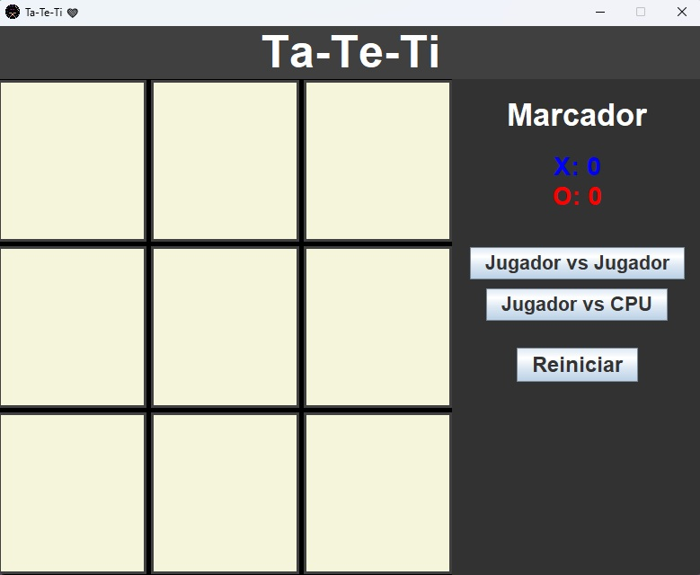

## 🎮 Ta-Te-Ti ❤️

** Un clásico juego de Ta-Te-Ti (Tic-Tac-Toe) en Java con interfaz gráfica y modo contra CPU.**

---

## 🖥️ Captura del Juego



---


## 🎯 Características

- ✅ **Jugador vs Jugador**  
- ✅ **Jugador vs CPU** (modo fácil o imposible)  
- ✅ **Elección de quién comienza**  
- ✅ **Contador de victorias**  
- ✅ **Colores diferenciados para X y O**  
- ✅ **Panel de control moderno a la derecha**  
- ✅ **Tablero con color y bordes visibles**  
- ✅ **CPU con movimientos aleatorios y estratégicos**  

---


## 🕹️ Cómo jugar

1. Selecciona el modo de juego:
   - **Jugador vs Jugador**  
   - **Jugador vs CPU**  
2. Escoge quién empieza (Jugador X o O / CPU).  
3. Haz clic en una casilla vacía para colocar tu ficha.  
4. El primer jugador que logre una línea de 3 fichas (horizontal, vertical o diagonal) gana.  
5. Si el tablero se llena y no hay ganador, el juego termina en empate.  
6. Consulta el **marcador** a la derecha para ver el número de victorias.  
7. Haz clic en **Reiniciar** para comenzar una nueva partida.  

---


## ⚙️ Requisitos

- Java JDK 8 o superior  
- IDE recomendado: IntelliJ, Eclipse o NetBeans  

---


## 📝 Cómo ejecutar

1. Clona este repositorio:

```bash
git clone https://github.com/tu-usuario/ta-te-ti-java.git
```


## 📝 Cómo Compilarlo

2. Compila el archivo TaTeTi.java:
```bash
javac TaTeTi.java
```


## 📝 Ejecutar el Juego

3. Ejecuta el juego:
```bash
java TaTeTi
```


## 🎨 Personalización

## Cambia los colores de X y O:

```java
casilla.setForeground(Color.BLUE); // X
casilla.setForeground(Color.RED);  // O
```

## Cambia el color de fondo del tablero:

```java
panelTablero.setBackground(Color.BLACK);
```


## 🤖 Inteligencia Artificial (CPU)

Modo Fácil: Movimientos aleatorios.

Modo Imposible: Minimax para jugar de forma estratégica y no perder.

La CPU puede empezar en cualquier posición aleatoria.


## ⚡ Tips

Para un desafío mayor, juega contra la CPU en modo Imposible.
Intenta un empate perfecto contra la CPU 😎


## Saludos!🖐🏻
 &emsp;
    <a href="#"></a>
  &emsp;


